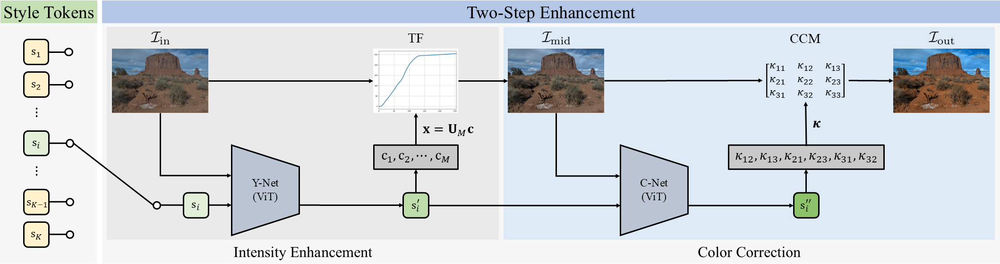

# Oneta: Multi-Style Image Enhancement Using Eigentransformation Functions

# Abstract
The first algorithm, called Oneta, for a novel task of multi-style image enhancement is proposed in this work. 
Oneta uses two point operators sequentially: intensity enhancement with a transformation function (TF) and color correction with a color correction matrix (CCM). 
This two-step enhancement model, though simple, achieves a high performance upper bound. Also, we introduce eigentransformation function (eigenTF) to represent TF compactly. 
The Oneta network comprises Y-Net and C-Net to predict eigenTF and CCM parameters, respectively. To support $K$ styles, Oneta employs $K$ learnable tokens. 
During training, each style token is learned using image pairs from the corresponding dataset. In testing, Oneta selects one of the $K$ style tokens to enhance an image accordingly. 
Extensive experiments show that the single Oneta network can effectively undertake six enhancement tasks --- retouching, image signal processing, low-light image enhancement, dehazing, underwater image enhancement, and white balancing --- across 30 datasets.

# Environment Setting

# Path Setting
